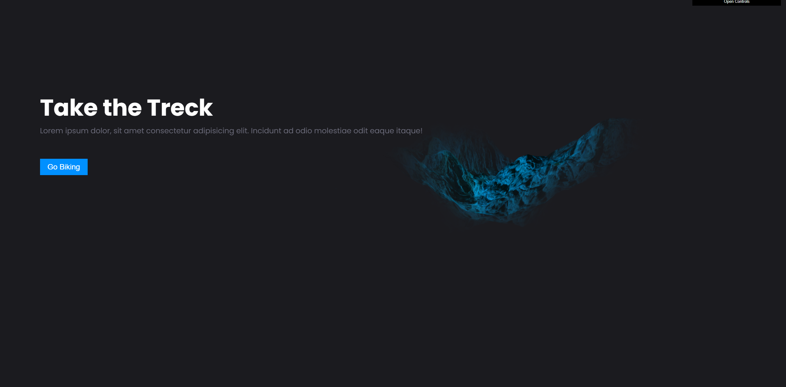

<div align="center">
  <h1>
    Alpha Map 
  </h1>
</div>

<div align="center">
  

  <!-- > <small>Posts feed on dark mode 🌃</small> -->
</div>

<!-- <div align="center">
  

  > <small>Posts feed on dark mode 🌑</small> -->
</div>

## 💡 You will need

- [Node JS](https://nodejs.org) installed on your host.

## 🎉 Starting

### Clone

In order to clone the project (via HTTPS), run this command:

```bash
git clone 
```

> 💡 SSH URLs provide access to a Git repository via SSH, a secure protocol. If you have a SSH key registered in your Github account, clone the project using this command: `git clone`


### Dependencies

Install the project dependencies:

``` bash
# Install dependencies (only the first time)
npm install
```
### Develop

``` bash
npm run dev
```
## Three.js Starter
Courtesy of Bruno Simon of https://threejs-journey.xyz/
